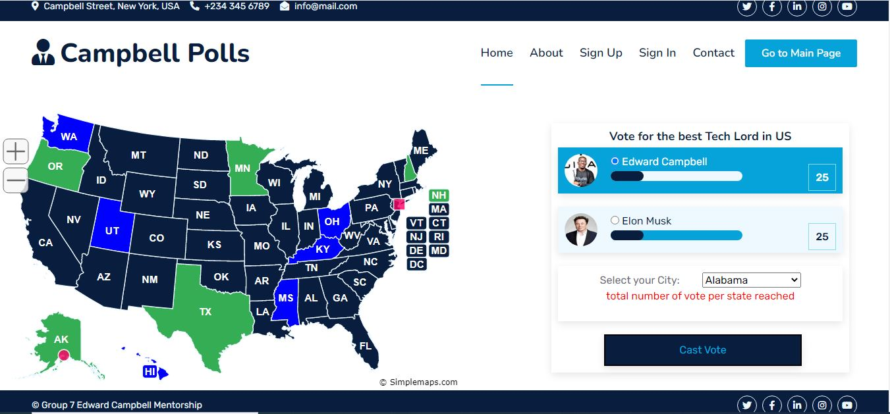

## Voting App

## Description
At the Edward Campbell Mentorship Program, we were assigned many task and one of the major task was to build a voting app with Javascript allowing users to vote for the best Tech Lord US.

## Tasks
1. Using Mouse Over function user should be able to know which contestant isactive while hovering through thier pictures.
1. State Map color should change depending on who is leading.
1. Description can be changed too (Optional).
1. There should be an allocated number of voters per state
1. There should be a progress Bar showing which contestant is leading
1. A score board showing thier scores

## Images
Homepage

Voting Page

## Authors
- [Akeh Emmanuel Unimke](https://github.com/Akeh9ja)
- [Enya Elvis](https://github.com/enyasystem)
